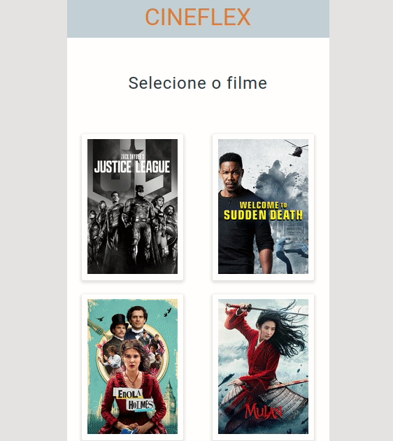

 <br>

# Cineflex
 <br> <br>
<a href='https://cineflex-aurfioan1-caiovitor1.vercel.app/'>  Teste aqui!</a>

# Tabela de Conteúdos

* [Sobre](#sobre)
* [Funcionalidades](#funcionalidades)
* [Tecnologias](#tecnologias)
* [Requisitos](#requisitos)

# Sobre
<h3> Nesse projeto fizemos uma Single-Page Application (SPA) para um cinema, usando React Router e consumindo uma API!</h3>
 <h3>O cliente poderá escolher qual filme ele deseja assistir e em seguida selecionará quais os assentos deseja ocupar e qual horário de sua preferência. Será possível ver quais os assentos estarão reservados.</h3>
<h3>  Ao finalizar o pedido o cliente terá acesso aos dados de sua compra e será possível voltar ao menu inicial.</h3> <br>


# Funcionalidades
<details>
    <summary><font size="4">Escolha de Filme (rota "/") </font></summary>
   <h3> -  Buscar as informações dos filmes pela API fornecida e exibir conforme layout fornecido</h3>
   <h3> -  Ao clicar em um filme, o usuário deve ser redirecionado para a rota "/sessoes/:idFilme", sendo :idFilme o id do filme clicado</h3> 

</details>

<details>
    <summary><font size="4">Escolha de Sessão (rota "/sessoes/:idFilme")</font></summary>
   <h3> -  A partir do id da URL, obtenha da API as sessões disponíveis para o filme e exiba conforme o layout fornecido</h3>
   <h3> -  Ao clicar em um filme, o usuário deve ser redirecionado para a rota "/sessoes/:idFilme", sendo :idFilme o id do filme clicado</h3> 

</details>

<details>
    <summary><font size="4">Escolha de Assento (rota "/assentos/:idSessao")</font></summary>
   <h3> -  A partir do id da sessão, buscar os dados da sessão da API e exibir o layout conforme fornecido</h3>
   <h3> -  Ao clicar em um assento disponível, o assento deve ser marcado como "Selecionado"</h3> 
   <h3> -  Ao clicar novamente em um assento selecionado, este deve voltar para "Disponível"</h3>
   <h3> -  Ao clicar em um assento indisponível, deverá ser exibido um alerta de "Esse assento não está disponível"</h3> 
    <h3> -  O usuário pode selecionar vários assentos</h3>
   <h3> -  O usuário deve poder inserir o nome e o CPF do comprador</h3> 
    <h3> -  Ao clicar em "Reservar assento(s)", o pedido deve ser enviado para o servidor e o usuário deve ser redirecionado para a rota "/sucesso".  Isso fará com os assentos marcados fiquem indisponíveis para outras marcações.</h3> 
</details>

<details>
    <summary><font size="4"> Rodapé</font></summary>
   <h3> -  Ao longo das telas de Sessão e Assento, deve ser exibido um rodapé com as informações do filme selecionado. Estas informações virão das chamadas à API em cada tela</h3>
  
</details>

<details>
    <summary><font size="4">Sucessp</font></summary>
   <h3> -  Implementar layout conforme fornecido, exibindo os dados do pedido feito</h3>
   <h3> -  Implementar layout conforme fornecido, exibindo os dados do pedido feito</h3> 

</details> <br>

# Tecnologias

 <br>

# Requisitos
<h3> Antes de começar você precisará ter instalado na sua máquina um setup de um projeto react, o que inclui:<a href='https://www.devmedia.com.br/como-instalar-o-node-js-npm-e-o-react-no-windows/40329'> npm </a> e create-react-app (caso você queira começar o projeto do zero). Além disso, é bom ter um editor para trabalhar com o código como o <a href='https://code.visualstudio.com/download' > VSCode.</a> </h3>
<h3> <b>Rodando o projeto em sua máquina:</b> </h3>

```bash

 # Clone o repositório do projeto:
 git clone</b> https://github.com/CaioVitor1/Cineflex.git
 # Acesse a pasta do projeto:
 cd cineflex
 # Instale as dependencias:
  npm i
 # Execute a aplicação em modo de desenvolvimento: 
 npm start
# O servidor irá rodar na porta 3000. Acesse: http://localhost:3000/ 
```

---

Made with love by <a href='https://www.linkedin.com/in/caiovitor33/'> Caio Vitor </a>


    
